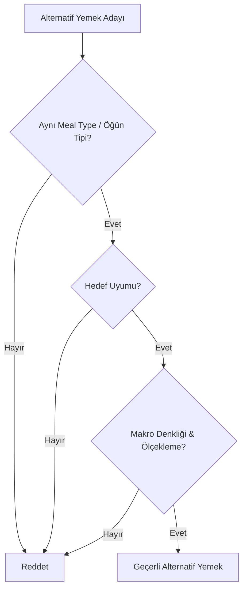

# Goal-Aware Alternatives Plan (Hedef Duyarlı Alternatif Yemek Planlama Sistemi)

Bu doküman, ZindeAI V2.0 beslenme motorunun kullanıcının fitness hedeflerine (`bulk`, `cut`, `maintain`) duyarlı alternatif yemekler önermesini sağlayacak mantıksal kuralları ve mimari tasarımı tanımlar. Doküman, mevcut veritabanı şemasını değiştirmeden hedeflere uyumlu çalışmayı sağlayacak geçiş stratejilerini ve katı kuralları (hard gates) kapsar.

---

## 1. Giriş ve Amaç

ZindeAI beslenme motorunun mevcut yapısında, yemek alternatifleri seçilirken sadece kalori ve makro benzerliklerine odaklanılmaktadır. Ancak bu durum, bir **Cut** (kalori kısıtlaması/zayıflama) kullanıcısına, günlük kalori limitini dolduracak ancak hacimce çok küçük olan (satiety/doyuruculuk indeksi düşük) **Bulk** (hacim kazanma) yemeklerinin (örneğin yüksek kalorili fıstık ezmeli barlar, kuruyemiş bombaları) önerilmesine yol açabilmektedir.

Bu planın amacı:
- Kullanıcının fitness hedefine (`bulk`, `cut`, `maintain`) göre yemeklerin mantıksal olarak filtrelenmesini sağlamak.
- Yüksek kalori yoğunluğuna (Calorie Density) sahip "Bulk" yemeklerinin "Cut" kullanıcılarına önerilmesini engellemek.
- Alternatif yemeklerin seçiminde **Aynı Meal Type + Hedef Uyumu + Makro Denkliği** kural setini katı bir şekilde (hard gate) uygulamak.
- Mevcut DB şemasını doğrudan migrate etmeden, esnek ve güvenli bir geçiş planı sunmak.

---

## 2. Veritabanı Şeması & Hedef Etiketleri (Goal Tags) Entegrasyonu

Mevcut veritabanı şemasında (`meals` tablosu), yemeklerin hangi fitness hedefine uygun olduğunu belirten doğrudan bir `goal_tag` veya `hedef` sütunu bulunmamaktadır. Ancak `etiketler` adında bir `JSONB` alanı mevcuttur.

### 2.1. Migration Yapmadan Geçiş Stratejisi (Mevcut Şema Kullanımı)
Veritabanı şemasında doğrudan bir DDL değişikliği (migration) yapmadan hedef etiketlerini desteklemek için iki yöntem kullanılacaktır:

1. **JSONB Etiket Yapısı (`etiketler` Sütunu)**:
   - Mevcut `etiketler` dizisinde özel ön ekli (prefix) etiketler tanımlanır.
   - Örn: `"goal:bulk"`, `"goal:cut"`, `"goal:maintain"`.
   - Dart tarafındaki `Yemek` entity'si, bu etiketleri okuyarak yemeğin hangi fitness hedefine yönelik tasarlandığını programatik olarak belirler.
   
2. **Programatik Kalori Yoğunluğu (Calorie Density) Hesaplama**:
   - DB seviyesinde etiket bulunmayan durumlar için yedek mekanizma (fallback) olarak yemeğin kalori yoğunluğu hesaplanır:
     $$\text{Calorie Density} = \frac{\text{Kalori}}{\text{Base Weight (Gram)}}$$
   - Kalori yoğunluğu yüksek olan (örn: 100 gramında > 2.5 kcal olan) yemekler programatik olarak **Bulk** kategorisinde değerlendirilir.
   - Kalori yoğunluğu düşük olan (örn: 100 gramında < 1.2 kcal olan) yemekler programatik olarak **Cut** kategorisinde değerlendirilir.

### 2.2. Gelecekteki DB Migration Planı (Sadece Dokümantasyon)
Gelecekte şema güncellemesi yapılmak istendiğinde uygulanacak yapısal migration planı şu şekildedir:

```sql
-- Yemekler tablosuna hedef uyumluluğunu belirten array sütunu eklenmesi
ALTER TABLE meals 
ADD COLUMN IF NOT EXISTS target_goals TEXT[] DEFAULT ARRAY['maintain']::TEXT[];

-- Hedef enum değerlerine uygun CHECK constraint eklenmesi
ALTER TABLE meals
ADD CONSTRAINT chk_meals_target_goals 
CHECK (target_goals_check(target_goals));

-- Yardımcı fonksiyon (array içindeki değerlerin bulk, cut, maintain olmasını doğrular)
CREATE OR REPLACE FUNCTION target_goals_check(target_goals TEXT[]) 
RETURNS BOOLEAN AS $$
DECLARE
  g TEXT;
BEGIN
  FOREACH g IN ARRAY target_goals LOOP
    IF g NOT IN ('bulk', 'cut', 'maintain') THEN
      RETURN FALSE;
    END IF;
  END LOOP;
  RETURN TRUE;
END;
$$ LANGUAGE plpgsql;
```

---

## 3. Bulk Yemeklerin Cut Kullanıcısına Önerilmesini Engelleme Kuralları

Bulk yemekleri genellikle düşük hacimde yüksek kalori sunarak hacim kazanma sürecini kolaylaştırmayı hedefler. Cut kullanıcısı için ise tam tersine, yüksek hacimli (mideyi dolduran, lif oranı yüksek) fakat düşük kalorili yemekler tercih edilmelidir. 

Bulk yemeklerinin Cut kullanıcısına önerilmesini engellemek için **Meal Optimizer (RPC)** ve **Meal Planner Use Case** seviyelerinde uygulanacak mantıksal kurallar şunlardır:

### Rule 3.1: Kalori Yoğunluğu Eşiği (Calorie Density Cap)
- **Kural**: Bir yemeğin kalori yoğunluğu ($\text{kcal/g}$) belirlenen eşik değerin üzerindeyse, bu yemek Cut kullanıcısının ana öğün planına veya alternatif listesine **dahil edilemez**.
- **Cut Eşik Değeri**: $\le 1.8 \text{ kcal/g}$ (Sıvı/içecekler hariç).
- **Örnek**: 100 gramında 350 kcal olan bir fıstık ezmeli yulaf barı ($3.5 \text{ kcal/g}$), Cut kullanıcısının kalori hedefine sığdırılmak için ölçeklendirilse dahi doyurucu olmayacağı için filtrelenir.

### Rule 3.2: Minimum Ölçekleme Çarpanı Sınırı (Min Multiplier Gate)
- ZindeAI beslenme motoru, bir yemeği kullanıcının öğün kalori hedefine uydurmak için ölçeklendirir (`scale`).
- **Kural**: Eğer bir yemeğin hedef kaloriye uyması için gereken ölçekleme çarpanı yemeğin `min_multiplier` değerinin altındaysa veya genel bir alt sınır olan **0.70**'in altındaysa, bu yemek Cut kullanıcısı için **reddedilir**.
- **Gerekçe**: Bir yemeğin porsiyonunu %30'dan fazla küçültmek, öğünün hacmini yetersiz kılacak ve kullanıcının açlık yönetimine (satiety) zarar verecektir.

### Rule 3.3: Yağ Kalorisi Oranı Sınırı (Fat Calorie Ratio Cap)
- **Kural**: Cut kullanıcıları için önerilecek yemeklerin yağdan gelen kalori oranı %35'i geçmemelidir (Sağlıklı yağ kaynakları içeren özel durumlar hariç).
- **Formül**: 
  $$\text{Yağ Kalori Oranı} = \frac{\text{Yağ (g)} \times 9}{\text{Toplam Kalori (kcal)}} \le 0.35$$

### Rule 3.4: Katı Etiket Filtresi (Hard Tag Filter)
- **Kural**: `etiketler` alanında `"goal:bulk"` veya `"bulk"` etiketi barındıran tüm yemekler, Cut kullanıcısının havuzundan tamamen çıkartılır. Bu kural hem ana yemek seçiminde hem de alternatif üretiminde uygulanır.

---

## 4. Aynı Meal Type + Hedef Uyumu + Makro Denkliği Kuralları (Alternatif Seçimi)

Kullanıcı bir yemeği değiştirmek istediğinde veya sistem alternatif yemekler üretirken, üretilen alternatifler şu 3 aşamalı **Katı Filtreden (Hard Gate)** geçmek zorundadır. Filtrelerden geçemeyen alternatifler kullanıcıya asla sunulmaz.



### 4.1. Aynı Meal Type (Öğün Tipi) Uyumu
- **Kural**: Alternatif yemeğin `ogun` (OgunTipi) alanı, asıl yemeğin `ogun` alanı ile birebir eşleşmelidir.
- **Detay**: Kahvaltı (`kahvalti`) yerine sadece kahvaltı alternatifleri, ara öğün (`ara_ogun_1`, `ara_ogun_2`) yerine sadece ara öğün alternatifleri gelebilir. Öğün tiplerinin birbirinin yerine önerilmesi engellenir.

### 4.2. Hedef Uyumu (Goal Alignment)
- **Kural**: Alternatif yemeğin fitness hedefi uyumluluğu, kullanıcının güncel hedefiyle eşleşmelidir.
- **Eşleşme Matrisi**:
  | Kullanıcı Hedefi | Kabul Edilen Yemek Etiketleri / Özellikleri | Reddedilen Yemekler |
  | :--- | :--- | :--- |
  | **Cut** | `"goal:cut"`, `"goal:maintain"`, Calorie Density $\le 1.8$ | `"goal:bulk"`, Calorie Density $> 1.8$ |
  | **Bulk** | `"goal:bulk"`, `"goal:maintain"`, Yüksek Enerji Yoğunluğu | Çok düşük kalorili/hacimli diyet yemekleri |
  | **Maintain** | `"goal:maintain"`, `"goal:cut"`, `"goal:bulk"` (Ölçeklenerek) | Yok |

### 4.3. Makro Denkliği (Macro Equivalence)
Alternatif yemeğin asıl yemeğin yerini alabilmesi için makrolarının "denk" olması gerekir. Makro denkliği şu kurallarla denetlenir:

1. **Tolerans Sınırları**:
   - Alternatif yemeğin ölçeklendirilmiş kalori ve makro değerleri, asıl yemeğe göre **±%10** limitleri içinde kalmalıdır.
   - Örn: Asıl yemek 500 kcal ise, alternatif yemek ölçeklendiğinde 450 - 550 kcal aralığında olmalıdır.

2. **Baskın Makro (Dominant Macro) Uyumu**:
   - Alternatif yemeğin `dominant_macro` alanı, asıl yemeğin `dominant_macro` alanı ile **aynı** olmalıdır.
   - **Gerekçe**: Kullanıcı protein ağırlıklı bir ana öğünü (örn: Tavuklu Salata) değiştirmek istediğinde, sistem ona karbonhidrat ağırlıklı bir yemek (örn: Makarna) öneremez. Alternatif yemek de protein ağırlıklı olmalıdır.

3. **Ölçeklenebilirlik Sınırları**:
   - Alternatif yemeğin, asıl yemeğin makrolarına denk gelebilmesi için ihtiyaç duyduğu ölçekleme çarpanı (`multiplier`), yemeğin kendi `min_multiplier` ve `max_multiplier` değerleri arasında olmalı ve hiçbir şekilde **[0.60, 2.50]** genel aralığının dışına çıkmamalıdır.

---

## 5. Mimari Katmanlara Göre Değişiklik Planı

### 5.1. Domain Katmanı (`lib/domain/`)
- **`Yemek` Entity'si**:
  - `kisitlamayaUygunMu` ve `tercihUygunMu` metodlarına benzer şekilde, kullanıcının hedefine uygunluğu denetleyen `hedefeUygunMu(Hedef kullaniciHedefi)` metodu eklenecektir.
- **`GenerateDailyPlan` & `MealOptimizer`**:
  - Alternatif yemek araması yaparken, hedef filtresi (`hedefeUygunMu`) sorguya dahil edilecektir.

### 5.2. Data Katmanı (`lib/data/`)
- **Supabase RPC (`get_best_fit_foods`)**:
  - SQL seviyesinde filtreleme yapmak için `p_user_goal` (kullanıcı hedefi) parametresi eklenecektir.
  - Eğer `p_user_goal = 'cut'` ise, kalori yoğunluğu $> 1.8$ olan veya `etiketler` alanında `'bulk'` içeren kayıtlar SQL sorgusunda filtrelenecektir.

### 5.3. Presentation Katmanı (`lib/presentation/`)
- **BLoC Katmanı (`HomeBloc`)**:
  - `GenerateAlternativeMeals` eventi tetiklendiğinde, kullanıcının profili üzerinden güncel `hedef` bilgisi alınarak alternatif üretici use-case'ine parametre olarak geçilecektir.

---

## 6. Özet ve Uygulama Sırası

1. **Aşama 1 (Hazırlık)**: Yemek veri tabanındaki (seeds/insert scriptleri) mevcut yemeklerin `etiketler` alanına `"goal:bulk"`, `"goal:cut"` ve `"goal:maintain"` etiketlerinin eklenmesi (Migration yapmadan, sadece veri güncelleyerek).
2. **Aşama 2 (Mantıksal Geliştirme)**: Dart domain katmanında hedef eşleştirme kurallarının ve kalori yoğunluğu hesaplama metodlarının yazılması.
3. **Aşama 3 (Entegrasyon)**: RPC ve use-case'lerde bu filtrelerin "hard gate" olarak devreye sokulması.
