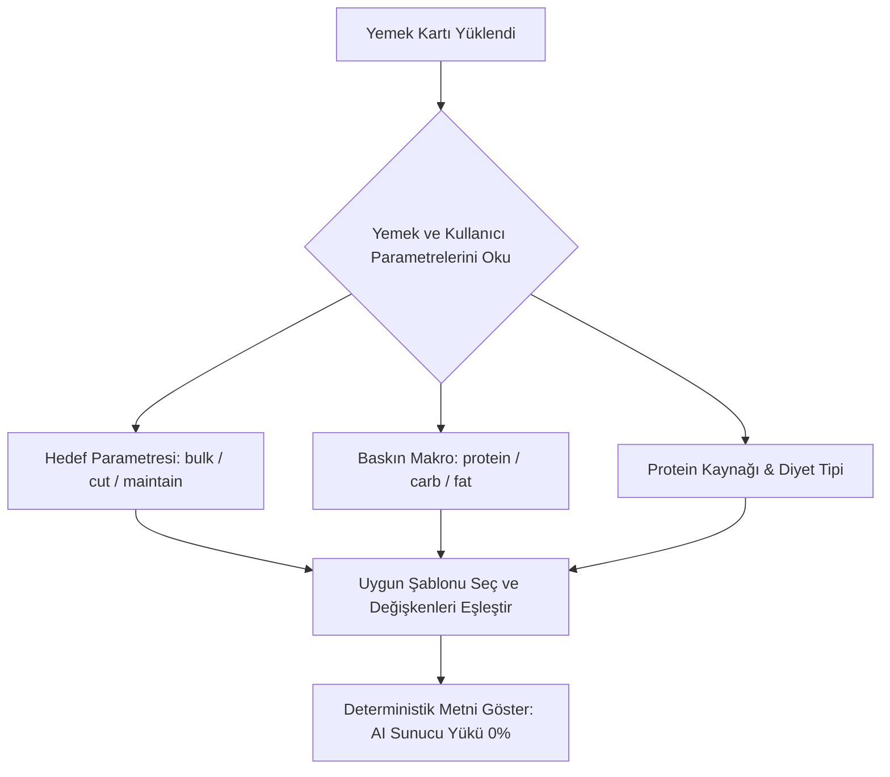

# ZindeAI V2.0 - Mobil Beslenme UI/UX Audit ve Tasarım Yönergesi

Bu doküman, ZindeAI V2.0 temiz mimari standartlarına ve ürün vizyonuna göre beslenme modülünün arayüz (UI/UX) tasarımı, akışı ve bileşen kurallarını detaylandırmaktadır. Bu yönerge doğrultusunda geliştirilen veya revize edilen tüm arayüz bileşenleri, arka planda çalışan beslenme motorunun (Nutrition Engine) tolerans kuralları, veri yapıları ve BLoC yapısıyla 1:1 uyumlu olmalıdır.

> [!IMPORTANT]
> **Geliştirici Notu:** Bu doküman bir tasarım ve denetim rehberidir. Uygulama içerisinde UI kod yazılmasını, veritabanı veya nutrition engine üzerinde kod değişikliği yapılmasını önermez; sadece mevcut yapının denetimini ve tasarımsal entegrasyon kurallarını tanımlar.

---

## 1. Meal Card (Yemek Kartı) Tasarımı ve Arayüz Standartları

Yemek kartı, kullanıcının günlük beslenme planındaki her bir öğünü yönettiği ana etkileşim merkezidir. Kart; porsiyon çarpanlarını, makroları, hazırlık sürelerini ve durum değişikliklerini yansıtmak zorundadır.

```
+-------------------------------------------------------------+
| [ Görsel: Yemek Fotoğrafı ]   Öğün Tipi: KAHVALTI  ⏰ 15 dk |
|                               Zorluk: Kolay (⭐)           |
|                                                             |
| Nefis Fit Pankek                                            |
|                                                             |
| Porsiyon Ayarı:                                             |
| [-] 1.0x (100g) [+]  |=======(Slider Multiplier)=======|    |
|                                                             |
| Makrolar:                 [!] Protein Dominant (Kas Desteği) |
| Kalori   : 445 kcal  |====================| (65%)           |
| Protein  : 19.0g     |=======| (19%)                        |
| Karb     : 62.0g     |=============| (62%)                  |
| Yağ      : 13.5g     |====| (13.5%)                         |
|                                                             |
| Malzemeler:                                                 |
| - 1 adet Yumurta (Çiğ)                                      |
| - 65g Yulaf Unu (Çiğ)                                       |
| - 125ml Süt (%1.5 Yarım Yağlı)                              |
|                                                             |
| +------------+  +------------+  +-------------+             |
| |  Yedim ✓   |  |   Atla ✗   |  | Değiştir ⇄  |             |
| +------------+  +------------+  +-------------+             |
+-------------------------------------------------------------+
```

### 1.1 Arayüz Bileşenleri ve Flex Yapısı
*   **Görsel Alanı:** 16:9 oranında veya sol blokta kare (1:1 aspect ratio) olarak yerleştirilmelidir. Görsel bulunmadığında fallback olarak öğünün emoji ikonu (örn. `OgunTipi.kahvalti` için 🍳) büyük boyutta soft bir arka plan rengiyle gösterilmelidir.
*   **Zorluk ve Hazırlama Süresi:** `Yemek` entity'si içindeki `hazirlamaSuresi` (dakika) ve `zorluk` (Zorluk enum: kolay, orta, zor) kartın sağ üst köşesinde chip (etiket) formunda gösterilmelidir.
*   **Çiğ mi Pişmiş mi (Raw/Cooked) Şeffaflığı:** Yemek adlarında veya malzeme detaylarında veritabanı sapmalarını önlemek amacıyla malzemenin çiğ/pişmiş durumu net belirtilmelidir. Örneğin: *“100g Çiğ Pirinç”* veya *“80g Pişmiş Somon”*.

### 1.2 Porsiyon Ölçekleme (Multiplier UI)
`Yemek` entity'sinde bulunan `minMultiplier` (varsayılan 0.5), `maxMultiplier` (varsayılan 3.0), `baseWeightG` (varsayılan 100g) ve `unitName` (varsayılan 'gram') değerleri kullanılarak arayüzde dinamik porsiyon güncellemesi sunulmalıdır:
*   Kullanıcıya porsiyon değerini değiştirebileceği bir **Slider** veya **Stepper (- / +)** bileşeni sunulur.
*   Değişim adımları `0.1x` hassasiyetinde olmalıdır.
*   Çarpan değiştikçe, `Yemek.scale(multiplier)` metodu çalıştırılarak kart üzerindeki tüm makro (kalori, protein, karbonhidrat, yağ) ve malzeme miktarları anlık olarak güncellenir.
*   **Malzeme Miktarı Formatlama Kuralı:** Ölçeklenen malzeme miktarları arayüzde saçma küsuratlarla gösterilmemelidir. `Yemek.scale()` içindeki yuvarlama mantığına uygun olarak; tam sayılar doğrudan tam sayı (örn. `2 adet Yumurta`), kesirli değerler ise en fazla 1 ondalık basamakla (örn. `1.3 adet Ekmek`) gösterilmelidir.

### 1.3 Makro & Kalori Dağılımı ve Dominant Makro Vurgusu
*   **Dominant Macro:** `Yemek` entity'sindeki `dominantMacro` alanı (protein, carb, fat) kontrol edilerek kartta baskın olan makro bileşeni görsel olarak ön plana çıkarılmalıdır.
    *   *Protein Dominant (`protein`)* ise: Kart çerçevesinde veya dominant makro etiketinde mavi/turkuaz vurgu.
    *   *Karbonhidrat Dominant (`carb`)* ise: Sarı/turuncu vurgu.
    *   *Yağ Dominant (`fat`)* ise: Yeşil vurgu.
*   Her makro değeri için ilerleme barı (progress bar) çizilirken, o makronun toplam kaloriye katkı yüzdesi (Protein * 4 / Kalori vb.) yüzde değeri olarak barın yanında gösterilebilir.

### 1.4 Öğün Onay Durumları (State-Driven UI)
`GunlukPlan` içindeki `ogunDurumlari` haritasından okunan durum değerlerine (`bekliyor`, `yedi`, `onaylandi`, `atandi`) göre kart tasarımı değişmelidir:

| Durum | Görsel Stil | Aktif Aksiyonlar | Gönderilen Event |
| :--- | :--- | :--- | :--- |
| **`bekliyor`** | Standart beyaz/gri arka plan, tüm detaylar görünür. | "Yedim ✓", "Atla ✗", "Değiştir ⇄" | `ConfirmMealEaten(yemekId)` |
| **`yedi` / `onaylandi`** | Yumuşak yeşil arka plan veya yeşil sol kenarlık, "Tamamlandı" rozeti. | "Geri Al ↺" (diğer butonlar gizlenir veya pasifleşir). | `ResetMealStatus(yemekId)` |
| **`atandi` (Atlandı)** | Opaklığı düşürülmüş (%50 opacity) sönük kart yapısı, üzeri hafif çizili. | "Geri Al ↺" (diğer butonlar gizlenir). | `ResetMealStatus(yemekId)` |

---

## 2. Swap Modal (Yemek Değiştirme) ve Alternatif Yönetimi

Kullanıcı plandaki bir yemeği sevmediğinde veya o an ulaşamadığında, `1 ana + 2 alternatif` prensibine dayalı olarak çalışan Swap modalı devreye girer.

```
+-----------------------------------------------------------+
| [X] Yemek Değiştir: "Izgara Tavuk Salatası"              |
|                                                           |
| Alternatif 1: Fırın Somon Izgara (Zorluk: Orta ⭐⭐)       |
| P: 25g | K: 10g | Y: 15g | 275 kcal                       |
| Fark: [ +15 kcal ]  [ +2g Protein ]  [ -3g Karb ]         |
| +-------------------------------------------------------+ |
| |                    Seç ve Uygula                      | |
| +-------------------------------------------------------+ |
|                                                           |
| Alternatif 2: Lor Peynirli Omlet (Zorluk: Kolay ⭐)       |
| P: 20g | K: 5g  | Y: 12g | 208 kcal                       |
| Fark: [ -52 kcal ]  [ -3g Protein ]  [ -8g Karb ]         |
| +-------------------------------------------------------+ |
| |                    Seç ve Uygula                      | |
| +-------------------------------------------------------+ |
|                                                           |
| (Veya) Sadece Malzeme Değiştir:                          |
| [>] Tavuk Göğsü yerine Hindi Füme kullan                |
+-----------------------------------------------------------+
```

### 2.1 Modal Açılış ve Alternatif Yemeklerin Listelenmesi
*   Kullanıcı meal card üzerindeki "Değiştir" butonuna dokunduğunda BLoC üzerinden alternatif yemekler listesi çekilir (`GenerateAlternativeMeals`).
*   Modal içinde, veritabanından gelen tam olarak 2 adet alternatif yemek seçeneği dikey kartlar halinde listelenir.
*   Her alternatif yemeğin görseli, adı, zorluk derecesi, hazırlama süresi ve makro değerleri gösterilir.

### 2.2 Makro/Kalori Delta (Fark) Görselleştirmesi
Kullanıcının karar vermesini kolaylaştırmak amacıyla, alternatif yemeklerin mevcut yemeğe göre makro ve kalori farkları (delta) anlık hesaplanarak görselleştirilmelidir:
*   **Kalori Farkı:** `Alternatif Kalori - Mevcut Kalori`
    *   Fark > 0 ise: `+X kcal` (Kırmızı/Turuncu renkte - kalori artışını belirtir).
    *   Fark <= 0 ise: `-X kcal` (Yeşil renkte - kalori düşüşünü belirtir).
*   **Protein Farkı:** `Alternatif Protein - Mevcut Protein`
    *   Fark >= 0 ise: `+Xg Protein` (Yeşil renkte - kas yapımı için pozitif değer).
    *   Fark < 0 ise: `-Xg Protein` (Kırmızı/Gri renkte - protein kaybı).
*   **Karbonhidrat ve Yağ Farkları:** Değer değişimlerine göre yeşil (azalış veya hedefe uygun artış) ya da gri/kırmızı tonlarda gösterilmelidir.

### 2.3 Malzeme Düzeyinde Alternatif (Ingredient Swap)
Yemeğin tamamını değiştirmek istemeyen, sadece içindeki belirli bir malzemeyi değiştirmek isteyen (alerji, kişisel tercih veya evde bulunmama durumunda) kullanıcılar için modalın alt kısmında bir "Malzeme Değiştir" bölümü yer almalıdır:
*   Mevcut yemeğin `alternatifler` listesindeki `AlternatifBesin` modelleri taranır.
*   Kullanıcı değiştirmek istediği malzemeyi seçtiğinde (örneğin *“Yulaf Unu”*), ona eşdeğer makroda ikame edilebilecek malzemeler listelenir (örneğin *“Karabuğday Unu (50g)”* veya *“Siyez Unu (45g)”*).
*   Kullanıcı seçim yaptığında `ReplaceIngredientWith` event'i tetiklenerek sadece yemek tarifi içerisindeki malzeme değiştirilir.

---

## 3. Macro Progress (Makro İlerleme) Görselleştirmesi

Günlük makro ilerleme göstergesi, kullanıcının gün içinde hedeflerine ne kadar yaklaştığını ve daha da önemlisi belirlenen tolerans aralığında kalıp kalmadığını gösteren bir dashboard bileşenidir.

```
Günlük Kalori Hedefi: 2000 kcal | Alınan: 1850 kcal
[========================================|--|======] (92.5%)
                                     Tolerans Alanı (±%10)

Protein : [===============================|--|===] 95 / 100g (Kalan: 5g)
Karb    : [=============================|--|=====] 190 / 220g (Kalan: 30g)
Yağ     : [==================================|--|] 65 / 60g (Aşım: 5g!)
```

### 3.1 Tolerans Aralığı Gösterimi (Target Window)
*   Beslenme motoru kurallarına göre (`calorieTolerancePct = 0.10` ve `macroTolerancePct = 0.10`), günlük hedeflerin ±%10 tolerans sınırı vardır.
*   Arayüzdeki makro ilerleme barlarının üzerinde, **hedef değerin %90'ı ile %110'u arasındaki bölge** ince dikey çizgilerle veya açık yeşil bir arka plan "penceresi" (Target Window) ile işaretlenmelidir.
*   Bu sayede kullanıcı, tam hedef noktasına (örn. 2000 kcal) ulaşmasa bile tolerans penceresinin içine girdiğinde hedefini başarıyla tamamladığını (onay durumuna ulaştığını) görsel olarak anlar.

### 3.2 Dinamik Durum ve Renk Kodlaması
İlerleme barlarının rengi, tüketime bağlı olarak dinamik değişmelidir:
*   **Tolerans Altında (Yetersiz - %90'ın altında):** Mavi veya gri tonlarında ilerleme barı. Kalan miktar belirgin şekilde yazılır (örn. *“Kalan: 30g”*).
*   **Tolerans İçinde (Mükemmel - %90 ile %110 arası):** Canlı yeşil renk. Hedefe ulaşıldığını belirten check işareti veya küçük yıldız animasyonu.
*   **Tolerans Üstünde (Aşım - %110'un üzerinde):** Sarı (hafif aşım) veya Kırmızı (ciddi aşım - %120+) bar rengi. Aşım miktarı vurgulanır (örn. *“Aşım: 15g!”*).

### 3.3 Dinamik Kalan Bütçe Hesaplaması
*   Günlük kalan kalori ve makro bütçesi, kullanıcının sadece yediğini onayladığı (`yedi` veya `onaylandi` durumundaki) öğünlerin toplam değerleri düşülerek anlık olarak güncellenmelidir.
*   Formül: `Kalan Makro = Hedef Makro - Tüketilen Makro (Onaylanan)`

---

## 4. Adherence Score (Plana Uyum Skoru) Takibi

Uyum skoru, ZindeAI'ın "suçlamayan, telafi etmeye yönlendiren koç" yaklaşımının en önemli göstergesidir. Kullanıcının günü ne kadar başarılı tamamladığını matematiksel olarak ifade ederken, psikolojik olarak da destekleyici olmalıdır.

```
+-----------------------------------------------------------+
|  Bugünkü Uyum Skorun: %85 [ İyi Durumda! 🌟 ]            |
|                                                           |
|  [========================================      ] (85/100)|
|                                                           |
|  AI Telafi Koçu Yorumu:                                   |
|  "Bugün öğle yemeğini atladığın için kalori ve protein    |
|  hedefinin biraz gerisinde kaldın. Hiç sorun değil!       |
|  Akşam yemeğinde tavuk porsiyonunu 1.3x ölçeğine getirerek |
|  makrolarını kolayca dengeleyebilirsin."                  |
+-----------------------------------------------------------+
```

### 4.1 Skor Hesaplama Yöntemi
Arayüzde gösterilecek olan uyum skoru, `GunlukPlan` entity'si içerisindeki iki temel metriğe dayanır:
1.  **Makro Kalite Skoru (`makroKaliteSkoru`):** Tüm makroların hedeften sapma oranlarına göre hesaplanan 100 puanlık bir kalitatif değerdir. Tolerans aralığındaki her sapma skordan puan düşürür.
2.  **Öğün Uyum Yüzdesi (`uyumYuzdesi`):** Plandaki öğünlerden kaç tanesinin `onaylandi` veya `yedi` durumuna getirildiğini gösterir.

### 4.2 Telafi Koçu Arayüzü ve Metin Şablonları
Uyum skorunun gösterildiği alanın hemen altında, kullanıcının durumuna göre dinamik geri bildirim veren bir panel yer almalıdır. Bu panelde **suçlayıcı olmayan, çözüm odaklı** Türkçe mesajlar sunulur:

*   **Skor %90 - %100 (Harika):**
    *   *Mesaj:* "Muhteşem bir gün! Hedeflerine tam uyum sağladın. Vücudun bu disiplin için sana teşekkür ediyor. Yarın da aynı enerjiyle devam edelim! 🚀"
*   **Skor %70 - %89 (Başarılı / Küçük Sapma):**
    *   *Mesaj:* "Bugün hedeflerine oldukça yakınsın. Ufak tefek sapmalar çok normal, kendini sıkmana gerek yok. Kalan öğünlerinde veya yarın ufak bir dengelemeyle yola tam gaz devam edebiliriz. 🌟"
*   **Skor %50 - %69 (Orta / Telafi Gerektiren):**
    *   *Mesaj:* "Bugün planın biraz gerisinde kaldık ama bu tamamen doğal bir durum. Yarın protein miktarını hafifçe artırarak veya sabah kahvaltısına ekstra bir yumurta ekleyerek bu günü kolayca telafi edebiliriz. Biz seninleyiz! 💪"
*   **Skor %50'nin Altında (Düşük / Yeniden Başlama):**
    *   *Mesaj:* "Bazen günler planladığımız gibi gitmeyebilir, bu diyetini bozduğun anlamına gelmez! Önemli olan pes etmemek. Yarın temiz bir sayfa açıyoruz; güne hafif bir yürüyüş ve dengeli bir kahvaltıyla başlamaya ne dersin? 🍎"

---

## 5. Optional Meals (Opsiyonel Yemek Alternatifleri) Yönetimi

Opsiyonel yemekler, kullanıcının temel makro hedeflerinin dışına çıkmak istediği esnek anları (sosyal etkinlikler, tatlı krizleri, ekstra spor yapılan günler vb.) yönetmesini sağlar.

### 5.1 Cheat Meal (Ödül Öğünü) Yönetimi
*   `OgunTipi.cheatMeal` tipi planda seçildiğinde, sistem bu öğünü standart makro tolerans hesaplamasından muaf tutmalıdır.
*   **UI Gösterimi:** Kartın üzerinde belirgin bir **"Cheat Meal / Serbest Öğün 🍕"** etiketi yer almalı ve bu kartın makroları gri renkte gösterilerek günlük zorunlu hedeflere dahil edilmediği, ancak kaloriyi artırdığı belirtilmelidir.
*   Kullanıcıya Cheat Meal onaylandığında: *"Bugün hak edilmiş bir mola verdin! Yarın dengeli plana sadık kalarak ilerlemeye devam edebiliriz."* gibi rahatlatıcı bir geri bildirim sunulmalıdır.

### 5.2 Gece Atıştırmalığı (`geceAtistirma`) Yönetimi
*   Cut (kilo verme) sürecindeki kullanıcılarda genellikle kapalı olan, ancak Bulk (kilo alma) hedeflerinde veya aktif günlerde beliren bir öğündür.
*   **UI Gösterimi:** Gece atıştırmalığı kartı, günün diğer ana öğünlerine göre daha ufak ve kompakt bir tasarımla sunulmalıdır.
*   Eğer günlük kalori bütçesi zaten aşılmışsa, gece atıştırmalığı kartı pasif hale gelmeli veya tıklandığında *"Günlük kalori limitine ulaştın. Bu öğünü eklemek hedeflerini biraz aşabilir. Yine de tüketmek istiyor musun?"* şeklinde yumuşak bir uyarı modalı çıkarmalıdır.

---

## 6. "Neden Bu Yemek?" (Why This Meal?) Deterministik Şablon Akışı

Kullanıcılara sunulan her öğünün altında, o yemeğin neden plana dahil edildiğini açıklayan bilgilendirici bir metin yer almalıdır. Bu metin, **her seferinde AI modeline API çağrısı yapıp token harcamak ve kararsız yanıtlar üretmek yerine**, veritabanındaki deterministik parametrelere göre dinamik olarak oluşturulan Türkçe şablonlardan çekilmelidir.

### 6.1 Karar Matrisi Parametreleri
Şablonların seçilmesinde ve birleştirilmesinde aşağıdaki değişkenler kullanılır:

1.  `hedef` (Kullanıcı Hedefi): `bulk` (Hacim/Kilo Alma), `cut` (Definasyon/Kilo Verme), `maintain` (Mevcut Kiloyu Koruma)
2.  `aktiviteSeviyesi` (Kullanıcı Aktivitesi): `sedanter`, `hafifAktif`, `ortaAktif`, `cokAktif`, `atletik`
3.  `dominantMacro` (Yemeğin Baskın Makrosu): `protein`, `carb`, `fat`
4.  `proteinKaynagi` (Yemekte Varsa): `tavuk`, `kırmızı et`, `balık`, `yumurta`, `bitkisel` vb.
5.  `diyetTipi` (Kullanıcı Diyet Tipi): `normal`, `vejetaryen`, `vegan`, `glutensiz`, `laktozsuz`
6.  `hazirlamaSuresi` (Hazırlık Süresi): `< 15` ise pratik, `>= 15` ise özenli.

### 6.2 Deterministik Metin Şablonları



#### Şablon 1: Protein Dominant Yemekler (Hedef: Bulk veya Cut)
*   *Koşul:* `dominantMacro == 'protein'` ve `hedef == 'cut' veya 'bulk'`
*   *Şablon:*
    > "Bu öğün, **{hedef}** sürecinde kas kütleni korumak/artırmak için özel olarak seçildi. İçeriğindeki kaliteli **{proteinKaynagi}** kaynağı, günlük protein ihtiyacını karşılarken uzun süre tok kalmana yardımcı olur. Diyet tipin olan **{diyetTipi}** beslenmeye %100 uygundur."
*   *Örnek Çıktı:* "Bu öğün, **kilo verme (cut)** sürecinde kas kütleni korumak/artırmak için özel olarak seçildi. İçeriğindeki kaliteli **tavuk** kaynağı, günlük protein ihtiyacını karşılarken uzun süre tok kalmana yardımcı olur. Diyet tipin olan **normal** beslenmeye %100 uygundur."

#### Şablon 2: Karbonhidrat Dominant Yemekler (Aktivite: Orta/Çok Aktif, Hedef: Bulk)
*   *Koşul:* `dominantMacro == 'carb'` ve `aktiviteSeviyesi == 'ortaAktif' veya 'cokAktif'` ve `hedef == 'bulk'`
*   *Şablon:*
    > "Gününün **{aktiviteSeviyesi}** temposuna ve **{hedef}** hedefine ayak uydurabilmek için enerji depolarını dolduracak bir öğün. **{ad}**, glikojen depolarını tazeleyerek antrenman performansını zirveye taşıyacak kaliteli karbonhidratlar içerir."
*   *Örnek Çıktı:* "Gününün **orta aktif** temposuna ve **kilo alma (bulk)** hedefine ayak uydurabilmek için enerji depolarını dolduracak bir öğün. **Muzlu Yulaf Lapası**, glikojen depolarını tazeleyerek antrenman performansını zirveye taşıyacak kaliteli karbonhidratlar içerir."

#### Şablon 3: Sağlıklı Yağ Dominant Yemekler (Diyet Tipi: Herhangi, Hedef: Maintain veya Cut)
*   *Koşul:* `dominantMacro == 'fat'`
*   *Şablon:*
    > "Vücudunun hormon dengesini desteklemek ve hücre yenilenmesini hızlandırmak için sağlıklı yağlar bu öğünde başrolde. Tokluk süreni uzatarak gün içindeki ani açlık krizlerinin önüne geçer."
*   *Örnek Çıktı:* "Vücudunun hormon dengesini desteklemek ve hücre yenilenmesini hızlandırmak için sağlıklı yağlar bu öğünde başrolde. Tokluk süreni uzatarak gün içindeki ani açlık krizlerinin önüne geçer."

#### Şablon 4: Pratik Hazırlanan Yemekler (Tüm Hedefler)
*   *Koşul:* `hazirlamaSuresi < 15`
*   *Şablon:*
    > "Yoğun günlerde beslenmeni aksatmamak için sadece **{hazirlamaSuresi} dakikada** hazırlayabileceğin pratik bir tarif. Hızlıca hazırlayıp hedeflerinden sapmadan gününe devam edebilirsin."
*   *Örnek Çıktı:* "Yoğun günlerde beslenmeni aksatmamak için sadece **10 dakikada** hazırlayabileceğin pratik bir tarif. Hızlıca hazırlayıp hedeflerinden sapmadan gününe devam edebilirsin."

---

## 7. UI/UX Denetim Listesi (Audit Checklist)

Tasarımcı ve geliştiriciler, beslenme modülünü yayına almadan önce arayüzün aşağıdaki denetim maddelerinden geçtiğini doğrulamalıdır:

- [ ] **Tolerans Alanı Gösterimi var mı?** Makro ve kalori barlarında ±%10 aralığını belirten yeşil alan veya dikey çizgiler arayüzde yer alıyor.
- [ ] **Porsiyon Kontrolü Gerçek Zamanlı mı?** Slider/Stepper ile çarpan değiştirildiğinde yemeğin tüm makro ve malzeme gramajları anında güncelleniyor.
- [ ] **Malzeme Gramajları Yuvarlanıyor mu?** Porsiyon değişiminde `2.001g` gibi küsuratlı değerler yerine temiz yuvarlanmış değerler gösteriliyor.
- [ ] **Swap Modal Delta Hesaplıyor mu?** Alternatif yemeklerin mevcut yemeğe göre kalori ve makro farkları (+/-) renk kodlarıyla modalda gösteriliyor.
- [ ] **Öğün Durum Geçişleri Doğru mu?** Yemek yendiğinde veya atlandığında kartın rengi ve aktif butonları durum haritasındaki (`bekliyor`, `yedi`, `onaylandi`, `atandi`) değerlere göre değişiyor.
- [ ] **Neden Bu Metni Statik mi?** Arayüzde "Neden bu?" açıklaması için sunucuya veya LLM API'sine istek atılmıyor; lokal karar matrisi üzerinden deterministik Türkçe şablonlar kullanılıyor.
- [ ] **İletişim Dili Korunuyor mu?** Hatalı veya sapmalı günlerde "Diyeti bozdun" gibi olumsuz uyarılar yerine "Yarın telafi edebiliriz" diyen yapıcı bir koçluk dili kullanılıyor.
