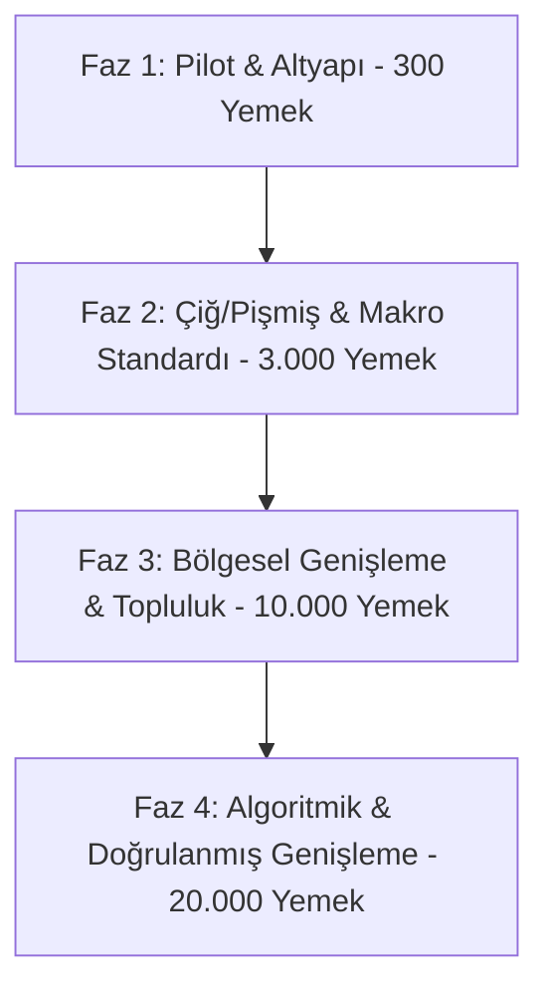
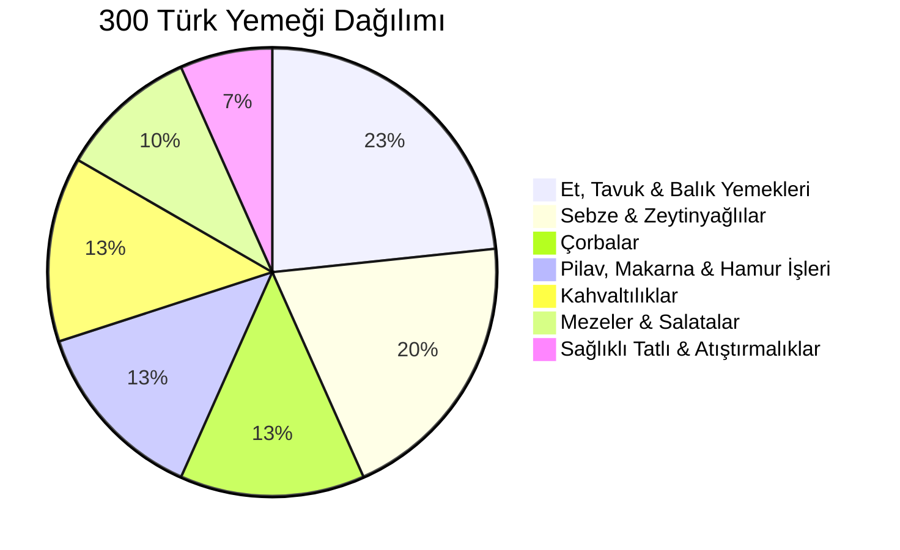

# ZindeAI V2.0 - Türk Yemekleri Veritabanı Genişletme Planı (Turkish Meal DB Expansion Plan)

Bu doküman, ZindeAI platformunun Türkçe öncelikli beslenme motorunun (Nutrition Engine) besin veritabanını genişletmek, veri tutarsızlıklarını gidermek, sahte (fake) varyasyonları engellemek ve çiğ/pişmiş besin ayrımı ile gerçekçi makro hesaplama standartlarını kurmak amacıyla hazırlanmış genişleme planıdır.

---

## 🎯 1. Genişleme Fazları (15k - 20k Yemek Hedefi)

15.000 - 20.000 doğrulanmış Türk yemeğine ulaşma hedefi, veri kalitesini ve sistem kararlılığını korumak adına 4 ana faza bölünmüştür:



### Faz 1: Pilot & Altyapı Standardizasyonu (Q3 2026)
* **Hedef:** 300 doğrulanmış, en popüler gerçek Türk yemeğinin eklenmesi ve mimari eksikliklerin giderilmesi.
* **Altyapı İşleri:** 
  * Veritabanı şemasına `base_id` ve `template_id` kolonlarının eklenmesi.
  * Tekrar filtresinin (repetition blocker) `base_id` üzerinden çalışacak şekilde güncellenmesi.
  * `meal_type` isimlendirmelerinin kod ve DB seviyesinde `gece_atistirmasi` olarak standardize edilmesi.
* **Veri:** Tamamen el ile girilmiş, diyetisyen onaylı 300 geleneksel tarif ve gerçek gramajlı malzemeler.

### Faz 2: Çiğ/Pişmiş Ayrımı & Ingredient-Derived Makro Entegrasyonu (Q4 2026 - Q1 2027)
* **Hedef:** Veritabanındaki yemek sayısını 3.000'e çıkarmak ve makro hesaplamalarını tamamen malzemelere bağlamak.
* **Altyapı İşleri:**
  * Çiğ (raw) ve pişmiş (cooked) besinlerin ayrımını yapacak verim katsayıları (`yield_factor`) tablosunun sisteme eklenmesi.
  * Yemeklerin makrolarının girilerek değil, alt malzemelerinin gramajlarından otomatik hesaplanmasını sağlayan DB Trigger veya RPC altyapısının kurulması.
* **Veri:** USDA ve TürKomp kaynaklı temel gıda kütüphanesinin (1.000+ temel hammadde) entegre edilmesi.

### Faz 3: Bölgesel Türk Mutfağı & Katkı Arayüzü (Q2 2027)
* **Hedef:** Bölgesel Türk yemeklerinin eklenmesiyle veritabanının 10.000 benzersiz yemeğe çıkarılması.
* **Altyapı İşleri:**
  * Diyetisyenler ve sertifikalı içerik üreticileri için tarif/yemek giriş paneli geliştirilmesi.
  * Otomatik makro doğrulama validator'ının (girilen malzemelerin makroları ile beyan edilen makro arasındaki farkı ölçen test) entegrasyonu.
* **Veri:** Ege (zeytinyağlılar), Güneydoğu (kebaplar ve etliler), Karadeniz (yöresel otlar ve balıklar) mutfaklarının taranması.

### Faz 4: Doğrulanmış Büyük Ölçekli Genişleme (Q3 - Q4 2027)
* **Hedef:** 15.000 - 20.000 doğrulanmış, varyasyonsuz, benzersiz Türk yemeğine ulaşmak.
* **Altyapı İşleri:**
  * AI destekli tarif ayrıştırma (recipe parsing) servisinin veritabanına sadece malzeme bazlı girdi yapıp makroyu yine deterministic motorla hesaplaması.
  * Büyük ölçekli veri seti üzerinde Euclidean Distance temelli `meal_optimizer` optimizasyonları.

---

## 🚫 2. Sahte Varyasyon Yasak Kuralı (Anti-Synthetic & Anti-Illusion Rules)

Mevcut sistemdeki "yemek çeşitliliği illüzyonu" ve "tekrar eden sahte yemekler" riskini tamamen ortadan kaldırmak için aşağıdaki sert kurallar uygulanacaktır:

### 1. Sıfat Ekleyerek Yemek Çoğaltma Yasağı (Anti-Adjective Rule)
Aynı malzemelere ve gramajlara sahip bir yemek, başına veya sonuna sıfat eklenerek ("Nefis Fit Pankek", "Pratik Fit Pankek", "Doyurucu Fit Pankek") yeni bir satır olarak veritabanına eklenemez.
* **Çözüm:** Yemek adı tekil ve net olmalıdır ("Fit Pankek"). Pişirme/sunum farkı varsa malzeme listesi değişmelidir.

### 2. Malzemeleri Aynı Tutup Makroları Rastgele Değiştirme Yasağı (Anti-Synthetic Macro Rule)
Bir yemeğin malzemeleri sabitken, hedef makrolara uydurmak amacıyla veritabanında rastgele çarpanlar (`pMult`, `cMult`, `fMult` vb.) kullanılarak sentetik makrolar üretilmesi KESİNLİKLE YASAKTIR.
* **Çözüm:** Bir yemeğin veritabanındaki protein, karbonhidrat, yağ ve kalori değerleri, yemeği oluşturan malzemelerin standart makro değerlerinin toplamına birebir eşit olmak zorundadır.

### 3. Base ID ve Şablon Yapısı
* Her yemek satırı bir `base_template_id` alanına sahip olmalıdır.
* `generate_daily_plan.dart` içindeki repetition tracker (tekrar engelleyici), yemeklerin tekil UUID'lerine veya isimlerine değil, bu `base_template_id` alanına bakmalıdır.
* Örneğin: "Pirinç Pilavı" ile "Şehriyeli Pirinç Pilavı" eğer çok benzer makrolara sahipse aynı `base_template_id`'yi paylaşabilir ve kullanıcının aynı gün/hafta içinde sürekli pilav yemesi bu şekilde engellenir.

---

## 📊 3. Malzemelerden Türetilmiş (Ingredient-Derived) Makro Standardı

Yemeklerin besin değerleri veritabanına statik veya tahmini olarak yazılmayacaktır. Tüm makrolar, yemeğin reçetesinde (tarifinde) yer alan malzemelerin ağırlıklarından matematiksel olarak türetilecektir.

### Matematiksel Formül ve Hesaplama Standardı
Bir yemeğin 100g'ındaki besin değeri şu şekilde hesaplanır:

1. **Toplam Besin Değeri Hesaplama:**
   $$ \text{Toplam Makro}_x = \sum_{i=1}^{n} \left( \text{Malzeme Gramajı}_i \times \frac{\text{Malzeme 100g'ındaki Makro}_x}{100} \right) $$
   *(Burada $x$: Protein, Karbonhidrat, Yağ veya Kalori'yi temsil eder).*

2. **Yemek Net Ağırlığı (Hazır/Pişmiş Ağırlık):**
   $$ \text{Toplam Ağırlık}_{\text{pişmiş}} = \sum_{i=1}^{n} \left( \text{Malzeme Gramajı}_i \times \text{Yield Factor}_i \right) $$

3. **100g Baz Değeri:**
   $$ \text{Yemek 100g Makro}_x = \left( \frac{\text{Toplam Makro}_x}{\text{Toplam Ağırlık}_{\text{pişmiş}}} \right) \times 100 $$

### Eşleşme Standardı
* Sistemdeki her tarif, `meal_ingredients` tablosunda temel bir malzeme ID'sine (örn: `ing_yulaf_001`, `ing_yumurta_001`) ve o tarifteki gramajına bağlıdır.
* Temel malzemelerin 100g değerleri USDA ve TürKomp referans alınarak kilitlenmiştir.

---

## 🍳 4. Çiğ (Raw) ve Pişmiş (Cooked) Malzemelerin Besin Değeri Ayrımı

Gıdaların pişirilmesi sırasında su kaybı (buharlaşma) veya su kazancı (haşlama) nedeniyle 100g başındaki kalori ve makro yoğunlukları dramatik şekilde değişir. Diyet planlamasında bu durumun göz ardı edilmesi %40'a varan kalori sapmalarına yol açar.

### Pişme Katsayıları (Yield & Retention Factors) Stratejisi
Her temel malzeme için çiğ-pişmiş ağırlık dönüşüm katsayıları (`yield_factor`) belirlenecektir:

| Malzeme Adı | Çiğ Durumu (100g) | Pişmiş Durumu Eşdeğeri | Yield Factor | Açıklama |
| :--- | :--- | :--- | :--- | :--- |
| **Pirinç (Baldo)** | 350 kcal | ~250g Pişmiş Pilav (~130 kcal/100g) | **2.50** | Su çekerek ağırlığı artar, kalori yoğunluğu düşer. |
| **Bulgur** | 340 kcal | ~260g Pişmiş Bulgur (~120 kcal/100g) | **2.60** | Su çekerek ağırlığı artar. |
| **Tavuk Göğsü** | 110 kcal | ~70g Izgara Tavuk (~165 kcal/100g) | **0.70** | Su kaybederek ağırlığı azalır, kalori yoğunluğu artar. |
| **Dana Kıyma (%10 Yağ)** | 170 kcal | ~75g Pişmiş Kıyma (~220 kcal/100g) | **0.75** | Yağ ve su kaybeder. |
| **Makarna** | 350 kcal | ~240g Haşlanmış Makarna (~140 kcal/100g)| **2.40** | Su çekerek ağırlığı artar. |

### Veri Modeli ve Kod Entegrasyon Stratejisi
1. **`is_raw` ve `state` Alanları:**
   Temel malzemeler tablosunda (`ingredients`) her besin için `is_raw` boolean değeri ve `state` (`raw`, `cooked`, `dried`) alanı bulunacaktır.
2. **Tarif Tanımlama Kuralı:**
   Tarifler girilirken malzemelerin çiğ mi yoksa pişmiş mi ölçüldüğü belirtilecektir. Örneğin: "100g Çiğ Pirinç" ile "100g Pişmiş Pirinç Pilavı" farklı makrolarla işleme alınacaktır.
3. **Porsiyon Hesaplama Modülü:**
   Kullanıcı tabakta "150g Pişmiş Pirinç Pilavı" tükettiğini belirttiğinde, arka planda bunun `150 / 2.5 = 60g` çiğ pirinç eşdeğeri olduğu hesaplanıp makro eşlemesi buna göre doğrulanacaktır.

---

## 🍽️ 5. `meal_type` ve `goal_tag` Stratejisi

### 1. `meal_type` (Öğün Tipi) Standardizasyonu
Teknik kontrattaki ve veri tabanındaki isimlendirme karmaşasını çözmek için öğün tipleri hem Dart enum'larında hem de Supabase CHECK constraint'lerinde birebir şu isimlerle kilitlenmelidir:
* `kahvalti` (Kahvaltı)
* `ara_ogun_1` (1. Ara Öğün)
* `ogle` (Öğle Yemeği)
* `ara_ogun_2` (2. Ara Öğün)
* `aksam` (Akşam Yemeği)
* `gece_atistirmasi` (Gece Atıştırmalığı)

*Not: Kodda veya DB'de `gece_atistirma` (sonunda 'si' olmadan) kullanımı tamamen engellenecektir.*

### 2. `goal_tag` (Hedef Etiketleri) Stratejisi
Yemeklerin `bulk` (Hacimlenme), `cut` (Yağ Yakımı/Kilo Verme) veya `maintain` (Form Koruma) hedeflerine uygunluğunu belirlemek için statik etiketleme yerine **Makro Yoğunluk Skoru (Macro Density Score - MDS)** algoritması kullanılacaktır.

```
MDS = (Protein Gramı * 4) / Toplam Kalori
CalorieDensity = Toplam Kalori / Toplam Ağırlık (g)
```

Yemekler bu değerlere göre otomatik olarak etiketlenecektir:

* 🟢 **`cut` Etiketleme Kriteri:**
  * Kalori Yoğunluğu (Calorie Density) < 1.3 kcal/g
  * MDS >= 0.30 (Kalorisinin en az %30'u proteinden gelen, lif oranı yüksek, hacimli ama düşük kalorili yemekler. Örn: Fırın Sebzeli Tavuk, Izgara Levrek, Kabak Çorbası).
* 🔴 **`bulk` Etiketleme Kriteri:**
  * Kalori Yoğunluğu (Calorie Density) >= 2.0 kcal/g
  * Yüksek kaliteli karbonhidrat ve sağlıklı yağ içeriği (Örn: Fıstık Ezmeli Yulaf Ezmesi, Zeytinyağlı Pirinç Pilavı, Cevizli Köfte).
* 🔵 **`maintain` Etiketleme Kriteri:**
  * Kalori Yoğunluğu 1.3 ile 2.0 kcal/g arası.
  * Dengeli makro dağılımı (%45 Karb, %25 Protein, %30 Yağ standardına yakın yemekler. Örn: Kıymalı Nohut Yemeği + Cacık).

---

## 🥗 6. Faz 1 Hedefi: 300 Gerçek Türk Yemeği Veritabanı Ekleme Planı

İlk aşamada eklenecek 300 yemek, Türk mutfak kültürünü en iyi yansıtan ve diyet planlarında sıkça tercih edilen tariflerden seçilmiştir.

### Kategori Dağılımı ve Sayılar



1. **Et, Tavuk & Balık Yemekleri (70 Adet):**
   * *Önemli Yemekler:* İzmir Köfte, Karnıyarık (fırınlanmış/az yağlı), Hünkar Beğendi (light beşamel ile), Tavuk Sote, Fırın Levrek, Tas Kebabı, Fırında Mücverli Tavuk.
   * *Veri Giriş Standardı:* Pişmiş et ağırlıkları çiğ karşılıklarıyla eşlenerek girilecektir.
2. **Sebze & Zeytinyağlılar (60 Adet):**
   * *Önemli Yemekler:* Zeytinyağlı Enginar, Taze Fasulye, Zeytinyağlı Bamya, İmambayıldı, Ispanak Yemeği, Fırın Kabak Mücver, Zeytinyağlı Pırasa.
   * *Veri Giriş Standardı:* Tariflerde kullanılan zeytinyağı miktarı net gramajla (ml veya g) belirtilecektir.
3. **Çorbalar (40 Adet):**
   * *Önemli Yemekler:* Süzme Mercimek, Ezogelin, Yayla, Tarhana, Domates, Tavuk Suyu, Beyran.
   * *Veri Giriş Standardı:* 1 kepçe (~150ml) and 1 kase (~250ml) porsiyon tanımlamaları yapılacaktır.
4. **Pilav, Makarna & Hamur İşleri (40 Adet):**
   * *Önemli Yemekler:* Sade Pirinç Pilavı, Bulgur Pilavı, Meyhane Pilavı, Kıymalı Tepsi Böreği (kalori kontrolü yapılmış porsiyon), Domatesli Makarna.
   * *Veri Giriş Standardı:* Çiğ pirinç/bulgur miktarları ve pişmiş son porsiyon ağırlıkları net olarak tanımlanacaktır.
5. **Kahvaltılıklar (40 Adet):**
   * *Önemli Yumurtalılar:* Menemen (soğanlı/soğansız varyasyonları tek tarifte birleştirilerek), Mıhlama (kalorisi hesaplanmış porsiyon), Yumurtalı Ekmek (fırında alternatifli), Çılbır.
6. **Mezeler & Salatalar (30 Adet):**
   * *Önemli Yemekler:* Haydari, Humus, Şakşuka (fırınlanmış patlıcan ile), Gavurdağı Salatası, Çoban Salatası, Muhammara.
7. **Sağlıklı Tatlı & Atıştırmalıklar (20 Adet):**
   * *Önemli Yemekler:* Fırın Sütlaç, Cevizli İncir Uyutması, Kabak Tatlısı (rafine şekersiz alternatiflerle), Hurmalı Fit Cezerye.

### Veri Giriş ve Doğrulama Protokolü
* Her yemek girişi için şu JSON şablonu doldurulacaktır:
```json
{
  "yemek_adi": "Fırında İzmir Köfte",
  "base_template_id": "meal_izmir_kofte_001",
  "ogun_tipleri": ["ogle", "aksam"],
  "hazirlama_suresi_dk": 45,
  "zorluk": "orta",
  "malzemeler": [
    {"ingredient_id": "ing_dana_kiyma_orta_yagli", "weight_g": 120, "state": "raw"},
    {"ingredient_id": "ing_kuru_sogan", "weight_g": 30, "state": "raw"},
    {"ingredient_id": "ing_patates", "weight_g": 80, "state": "raw"},
    {"ingredient_id": "ing_domates_salcasi", "weight_g": 15, "state": "raw"},
    {"ingredient_id": "ing_zeytinyağı", "weight_g": 5, "state": "raw"}
  ],
  "porsiyon_sayisi": 1,
  "toplam_pismis_agirlik_g": 210,
  "tarif": "Kıymayı rende soğan ve baharatlarla yoğurun. Patatesleri elma dilim doğrayıp köftelerle birlikte fırın kabına dizin. Üzerine salçalı su ve zeytinyağı gezdirip 200 derecede pişirin."
}
```
* Bu veri girildiğinde, sistem yukarıda belirtilen **Ingredient-Derived** formülü kullanarak yemeğin kalori ve makrolarını otomatik hesaplayacak ve veritabanındaki `yemek` tablosuna yazacaktır. AI veya insan eliyle manuel makro girişi kesinlikle yapılmayacaktır.
